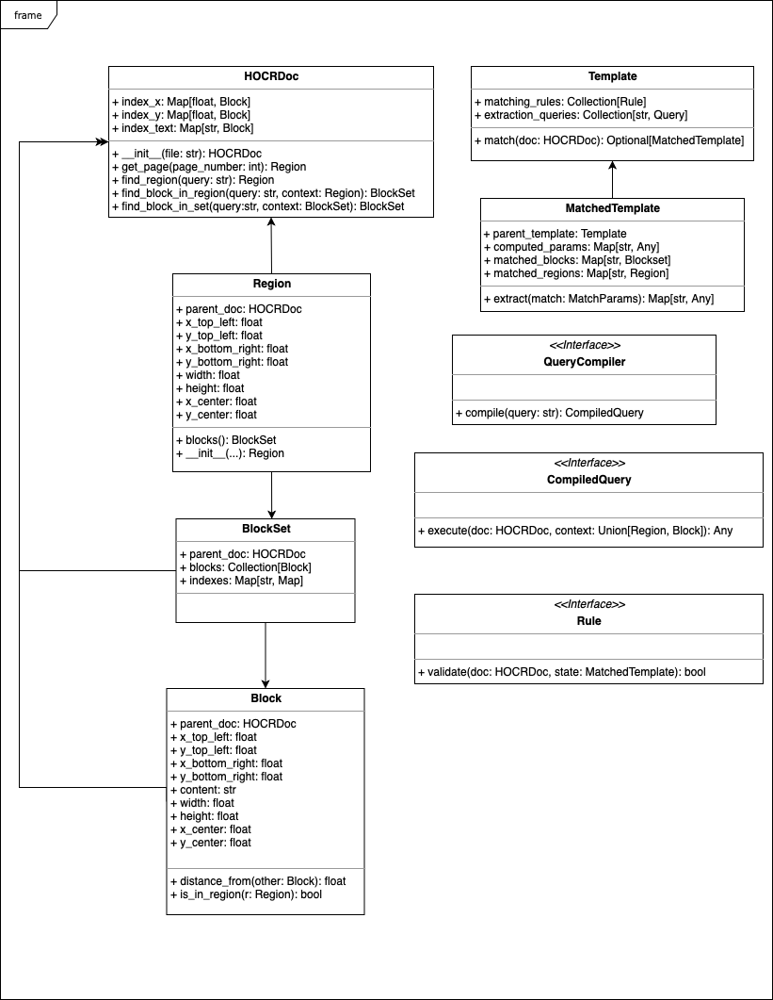

# Automation of Accounts Receivable Processing

## Design for remittance notice parsing

### Sequence diagram depicting the overall flow

Note: to edit the sequence diagram, load [docs/remittance-notice-parsing.websequencediagrams.txt] at
[websequencediagrams.com](https://www.websequencediagrams.com).

### Class diagram showing the structure of the code involved

Note: to edit the class diagram, load load [docs/HOCRQueryEngine.drawio] into [draw.io](https://app.diagrams.net).
