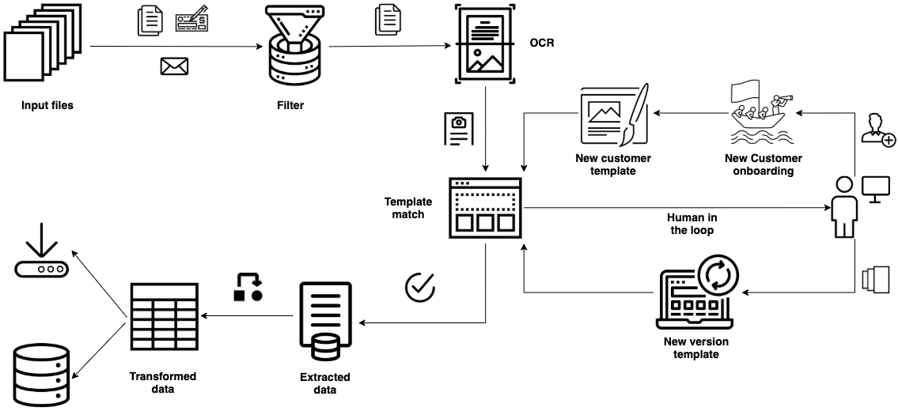

# Automation of Accounts Receivable Processing

## Design for remittance notice parsing

### Sequence diagram depicting the overall flow

Note: to edit the sequence diagram, load [docs/remittance-notice-parsing.websequencediagrams.txt] at
[websequencediagrams.com](https://www.websequencediagrams.com).

### Class diagram showing the structure of the code involved

Note: to edit the class diagram, load load [docs/HOCRQueryEngine.drawio] into [draw.io](https://app.diagrams.net).

### Workflow diagram

### TO-DO LIST
* Update the templates by taking ocr issues into consideration. One template per customer might not be sufficent. Implement ver1, ver2 etc.
* Need to fix `Net Amount` extraction in `IPG` template. Interspersed rows is causing issues.
* Better error handling is required. Currently all exception file names are dumped into a textfile. Need to specify for what error were they dumped.
* Converting to `float` on extraction rejects negative numbers if negative sign is present on the right side. Need to fix this. 
* Some templates might have varying invoice numbers. Need to pick these up to improve regex checks.